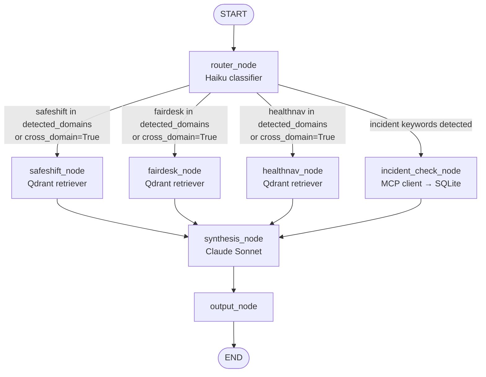

# WorkerShield v1 — Claude Code Project Context

## Current Status (as at 2026-06-12)

v1 is complete and demo-ready.

- **Corpus ingested:** 9 registered documents → 10 doc_ids (SS03 split into SS03a/SS03b), 1,268 vectors in Qdrant collection `workershield`.
- **Agents built:** `router_node` (Haiku + keyword fallback), `safeshift_node`, `fairdesk_node`, `healthnav_node` (Qdrant retrievers with Phoenix OTEL spans), `incident_check_node` (MCP client → SQLite incident database, conditional on incident keywords), `synthesis_node` (Sonnet with refusal threshold — avg < 0.65 AND max < 0.70 → `confidence="insufficient"`), `output_node` (JSONL log).
- **MCP incident server:** `mcp_server/incident_server.py` exposes 3 tools (`query_incidents`, `get_incident_summary`, `get_incident_detail`) over stdio transport. Registered in Claude Code as `workershield-incidents`. Backed by `data/incidents.db` (50 synthetic records across all 3 domains, June 2025–June 2026).
- **RAGAS evaluation complete:** 8-query golden dataset, OpenAI GPT-4o-mini judge. Faithfulness 0.894 ✅, Context Precision 0.750 ✅, Context Recall 0.750 ✅, Answer Relevancy 0.639 ⚠️. Results in `tests/ragas_results.json` and `tests/RAGAS_RESULTS.md`.
- **Phoenix tracing active:** Every query traces to `http://192.168.100.10:6006` via Arize Phoenix OTEL auto-instrumentation on the Anthropic SDK.
- **Gradio UI live:** `ui/app.py` on port 7860. Anthropic-only stack (Haiku router + Sonnet synthesis). Confidence badge supports `high`/`medium`/`low`/`insufficient` (grey OUT OF SCOPE badge for refusals). 5 example queries including incident-statistics demo. `launch.sh` as the entry point.
- **Known gap:** `parse_llm_json` Pass 3 (`_heal_inner_quotes`) and `max_tokens=4096` fix a Sonnet double-encoding bug that appeared on complex multi-domain responses. Do not revert these.

## Project

WorkerShield is an agentic RAG platform providing cited, practical guidance across three
Australian workplace compliance domains: **SafeShift** (WHS law), **FairDesk** (Fair Work),
and **HealthNav** (Occupational Health). Built by Raj Prasannakumar under BrickByData /
ModernAnalyticsLab as a portfolio project demonstrating production-grade agentic RAG
architecture for technical hiring managers at Microsoft-aligned data and AI consulting
firms evaluating Fabric Practice Lead candidates.

---

## Tech Stack

| Component | Technology |
|---|---|
| Agent framework | LangGraph (`StateGraph`) |
| Vector store | Qdrant — Docker, `localhost:6333`, collection: `workershield` |
| Embedding model | Ollama `nomic-embed-text` — local, 768 dimensions |
| Router LLM | Claude Haiku via Anthropic API — JSON classification |
| Synthesis LLM | Claude Sonnet 4 via Anthropic API — cited answers |
| Incident database | SQLite — `data/incidents.db`, 50 synthetic records across 3 domains |
| MCP server | `mcp` Python SDK — FastMCP stdio server, registered as `workershield-incidents` |
| Demo UI | Gradio — `ui/app.py`, `localhost:7860` |
| Observability | JSONL run logs — `logs/run_log.jsonl`, `utils/logger.py` |
| Dev environment | PortfolioLab Hyper-V, Ubuntu 24.04, VS Code Remote SSH |

---

## Three Domains

| Domain key | Scope |
|---|---|
| `safeshift` | WHS law, QLD codes of practice, WHS Act duties, PPE, manual handling, fatigue (safety lens) |
| `fairdesk` | Fair Work Act, NES, casual conversion, flexible working, termination, modern awards |
| `healthnav` | Occupational health, workers compensation, mental health at work, WorkCover QLD obligations |

---

## Corpus

9 documents — 3 per domain — all Australian open government sources.
Full document list with source URLs and chunk configuration: `corpus/corpus_registry.yaml`.
Chunk strategy: sliding window, 400 tokens, 50 token overlap, applied uniformly across all documents.

---

## LangGraph State

`WorkerShieldState` TypedDict — all inter-node data flows through this object:

```python
query: str                     # raw user input
detected_domains: list[str]    # router output: ['safeshift', 'fairdesk', 'healthnav']
cross_domain: bool             # True when query spans multiple domains
safeshift_chunks: list[dict]   # top-K chunks from SafeShift partition (operator.add annotated)
fairdesk_chunks: list[dict]    # top-K chunks from FairDesk partition (operator.add annotated)
healthnav_chunks: list[dict]   # top-K chunks from HealthNav partition (operator.add annotated)
incident_data: list[dict]      # incident records/summary from MCP server (populated by incident_check_node)
synthesis_input: str           # assembled context string passed to Sonnet
final_answer: str              # Sonnet's cited answer
citations: list[dict]          # [{doc_id, doc_title, section, domain, excerpt}, ...]
confidence: str                # "high" | "medium" | "low" | "insufficient"
```

---

## Graph Flow



Conditional edge after `router_node`:
- `cross_domain = True` → retrieval queries **all three** domain partitions
- `cross_domain = False` → retrieval queries **only** `detected_domains`
- Incident keywords detected (`"how many"`, `"incidents"`, `"cases"`, `"history"`, `"trend"`, `"statistics"`) → `incident_check_node` runs **in parallel** with domain retrieval nodes

---

## Key Files

| File | Purpose |
|---|---|
| `corpus/corpus_registry.yaml` | Document registry — drives the full ingestion pipeline |
| `prompts/PROMPTS.md` | Master prompt reference — router, synthesis, citation format |
| `agents/router.py` | Domain classifier — Haiku + keyword fallback |
| `agents/retrieval.py` | Three domain retrievers + cross-domain merge |
| `agents/graph.py` | LangGraph state machine — nodes, conditional routing, `incident_check_node` |
| `agents/synthesis.py` | Synthesis node — refusal threshold, context builder (inc. incident data), Sonnet call |
| `ingest/load_qdrant.py` | PDF extraction, chunking, embedding, Qdrant upsert |
| `data/incidents_schema.md` | Incident database schema design |
| `data/incidents_db.py` | Shared SQLite query helpers (used by MCP server and agent node) |
| `data/generate_incidents.py` | Synthetic incident generator — reproduces `data/incidents.db` |
| `data/incidents.db` | SQLite incident database — 50 synthetic records across 3 domains |
| `mcp_server/incident_server.py` | FastMCP stdio server — exposes 3 incident query tools |
| `mcp_server/README.md` | MCP server registration instructions |
| `ui/app.py` | Gradio demo interface — 5 example queries |
| `utils/logger.py` | JSONL run logging |
| `utils/log_reader.py` | Log summary viewer |
| `docs/ARCHITECTURE.md` | Full system architecture reference |

---

## MCP Incident Database

The `workershield-incidents` MCP server is registered in Claude Code. Tools:

| Tool | Use when |
|---|---|
| `get_incident_summary()` | "how many", "count", "trend", "summary" queries |
| `query_incidents(domain, status, category, date_from, date_to)` | Specific filtered queries |
| `get_incident_detail(incident_id)` | Lookup a specific record by `INC-NNN` |

The `incident_check_node` in `agents/graph.py` detects incident-related keywords and calls these tools via the Python MCP client (`mcp.client.stdio`). Results land in `state["incident_data"]` and are injected into the synthesis context as an `── INCIDENT DATABASE ──` section. Sonnet is instructed to cite these as "internal incident records" (not as document citations).

To regenerate the database: `python3 data/generate_incidents.py` (deterministic, seed=42).

---

## Coding Conventions

- **Python:** `snake_case`, type hints on all functions, Google-style docstrings
- All agent functions return typed dicts matching `WorkerShieldState` fields
- Wrap all Anthropic and Qdrant API calls in `try/except`; log errors to run log
- **Commit prefixes:** `feat:` / `fix:` / `docs:` / `refactor:` / `test:`
- Australian English in all documentation and inline comments

---

## Demo Queries

### Primary demo (cross-domain)
```
"My FIFO worker has a mental health condition and wants to reduce hours —
what are my obligations under safety law and fair work?"
```
Expected: `cross_domain = True`, all three retrievers fire, citations from SafeShift (WHS duty of care), FairDesk (flexible working NES entitlements), and HealthNav (mental health employer obligations).

### Incident + obligations demo (MCP)
```
"How many fatigue-related incidents have we had this year,
and what are our obligations to manage fatigue risk?"
```
Expected: `incident_check_node` fires alongside `safeshift_node` + `healthnav_node`. Answer references both internal incident statistics (e.g. "6 fatigue-related incidents in SafeShift records") and document-based obligations from retrieved chunks.
