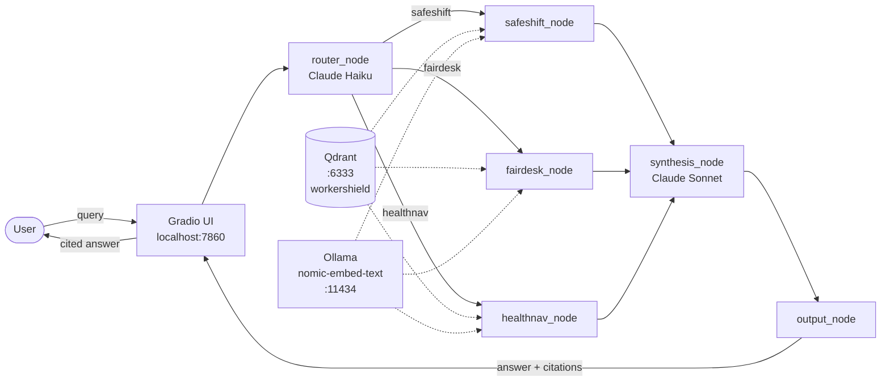

# WorkerShield v1

**Agentic RAG for Australian workplace compliance — cited answers across safety law, Fair Work, and occupational health.**


---

## Overview

WorkerShield is a production-grade agentic RAG platform that gives Australian employers and HR practitioners fast, cited answers to workplace compliance questions. It covers three domains — WHS/safety law, Fair Work Act entitlements, and occupational health — within a single agent graph that routes queries, retrieves relevant legislation and codes of practice, and synthesises a grounded answer with traceable citations.

The platform is designed for the compliance questions that actually come up on the floor: FIFO fatigue risk, casual conversion rights, what happens when a worker lodges a WorkCover claim, how to handle a flexible working request from someone managing a mental health condition. Rather than returning a document list, WorkerShield returns a direct answer with the source, section, and domain clearly attributed — the kind of output a senior HR manager or safety officer can act on.

WorkerShield v1 is a portfolio project demonstrating end-to-end agentic RAG architecture: domain routing with a lightweight LLM, partitioned vector retrieval, cross-domain synthesis, and a Gradio demo UI — all wired together with LangGraph's `StateGraph`.

---

## Architecture



The full agent graph is implemented as a LangGraph `StateGraph` with a single typed state object (`WorkerShieldState`) flowing through four nodes: `router_node → retrieval_node → synthesis_node → output_node`. A conditional edge after the router fires all three retrievers when `cross_domain = True`, or only the detected subset otherwise.

---

## Three Domains

| Domain | Coverage | Source Documents |
|---|---|---|
| **SafeShift** | WHS Act 2011 duties, QLD codes of practice, PPE, manual handling, fatigue risk, PCBU obligations | Managing Work Environment COP, Hazardous Manual Tasks COP, WHS Act Key Duties Summary |
| **FairDesk** | Fair Work Act, National Employment Standards (NES), casual conversion, flexible working, termination notice | NES Employee Guide, Casual Employment Employer Guide, Flexible Working Arrangements Guide |
| **HealthNav** | Occupational health, work-related mental health, fatigue management, workers compensation, WorkCover QLD obligations | Mental Health Employer Guide (Safe Work Australia), Fatigue Management Guide (Safe Work Australia), Workers Compensation Employer Guide (WorkCover QLD) |

All source documents are Australian open government publications. 9 documents, 3 per domain.

---

## Tech Stack

| Component | Technology | Purpose |
|---|---|---|
| Agent framework | LangGraph `StateGraph` | Directed graph orchestration with typed shared state |
| Router LLM | Claude Haiku (Anthropic API) | Lightweight domain classification with JSON output |
| Synthesis LLM | Claude Sonnet (Anthropic API) | Cited answer generation from retrieved context |
| Vector store | Qdrant — Docker, `localhost:6333` | Partitioned document retrieval by domain |
| Embedding model | Ollama `nomic-embed-text` (local, 768d) | Offline text embedding for ingestion and query |
| Chunking | Sliding window — 400 tokens, 50 overlap | Applied uniformly across all 9 source documents |
| Demo UI | Gradio (`ui/app.py`) | Browser-based query interface at `localhost:7860` |
| Observability | JSONL run logs (`logs/run_log.jsonl`) | Structured per-query logging via `utils/logger.py` |

---

## Quick Start

**Prerequisites:** Python 3.11+, Docker, Ollama with `nomic-embed-text` pulled, an Anthropic API key.

1. **Clone the repository**
   ```bash
   git clone https://github.com/rajprasannakumar/workershield-v1.git
   cd workershield-v1
   ```

2. **Install Python dependencies**
   ```bash
   pip install -r requirements.txt
   ```

3. **Configure environment variables**
   ```bash
   cp .env.example .env
   # Edit .env and set ANTHROPIC_API_KEY=<your key>
   ```

4. **Start Qdrant**
   ```bash
   docker run -p 6333:6333 qdrant/qdrant
   ```

5. **Ingest the corpus into Qdrant**
   ```bash
   python ingest/load_qdrant.py
   ```
   This extracts, chunks, embeds, and upserts all 9 documents into the `workershield` collection.

6. **Launch the demo UI**
   ```bash
   python ui/app.py
   ```
   Open `http://localhost:7860` in your browser.

---

## Example Queries

| Query | Domains Activated |
|---|---|
| "What are my obligations as a PCBU under the WHS Act?" | `[safeshift]` |
| "Is my casual employee entitled to conversion to permanent part-time?" | `[fairdesk]` |
| "What must I do when a worker lodges a WorkCover claim?" | `[healthnav]` |
| "My FIFO worker has a mental health condition and wants to reduce hours — what are my obligations under safety law and fair work?" | `[safeshift, fairdesk, healthnav]` |
| "Can I refuse a flexible working request from a worker managing fatigue from night shifts?" | `[safeshift, fairdesk]` |

The fourth query is the primary demo query for cross-domain synthesis: it activates all three retrievers and returns a single answer citing WHS duty of care, NES flexible working entitlements, and mental health employer obligations.

---

## Observability

Every query run is appended as a structured JSON record to `logs/run_log.jsonl` via `utils/logger.py`. Each record captures the raw query, detected domains, `cross_domain` flag, chunk counts retrieved per domain, the synthesis input size, and the final answer with citations. The companion utility `utils/log_reader.py` prints a human-readable summary of recent runs — useful for iterating on prompt quality and diagnosing routing errors during development.

---

## Known Limitations

- **Corpus is static and narrow.** v1 covers 9 documents across 3 domains. Coverage gaps exist — particularly in modern award specifics, state-based WHS regulations outside QLD, and workers compensation schemes outside Queensland.
- **Embeddings are local and not cached.** `nomic-embed-text` runs via Ollama at query time. On low-spec hardware, embedding latency adds to end-to-end response time; there is no query-level embedding cache in v1.
- **No answer grounding verification.** The synthesis node does not verify that citations map to actual retrieved chunks. Hallucinated citations are possible if the LLM deviates from the system prompt.
- **Single-turn only.** WorkerShield v1 has no conversation memory. Each query is processed independently; follow-up questions cannot reference prior answers.

---

## Roadmap

| Version | Planned Improvements |
|---|---|
| **v2 corpus** | Expand to 20+ documents per domain; add modern awards, state-based safety regulations (NSW, VIC), and Fair Work Commission recent decisions |
| **HealthNav expansion** | Add WorkSafe VIC and SafeWork NSW guidance; include return-to-work coordinator obligations and rehabilitation provider frameworks |
| **Microsoft Fabric integration** | Move vector index and run logs to Fabric OneLake; enable Fabric Eventhouse for real-time query telemetry and corpus refresh pipelines |
| **Cortex Analyst layer** | Cross-platform natural language query layer over structured compliance metadata — enabling trend queries ("what topics are users asking about most?") alongside the document RAG path |

---

## Author

Built by **Raj Prasannakumar** — BrickByData / ModernAnalyticsLab

- LinkedIn: [linkedin.com/in/rajprasannakumar](https://linkedin.com/in/rajprasannakumar)
- GitHub: [github.com/rajprasannakumar](https://github.com/rajprasannakumar)

WorkerShield v1 is a portfolio project demonstrating production-grade agentic RAG architecture for Australian workplace compliance. It is not legal advice.
