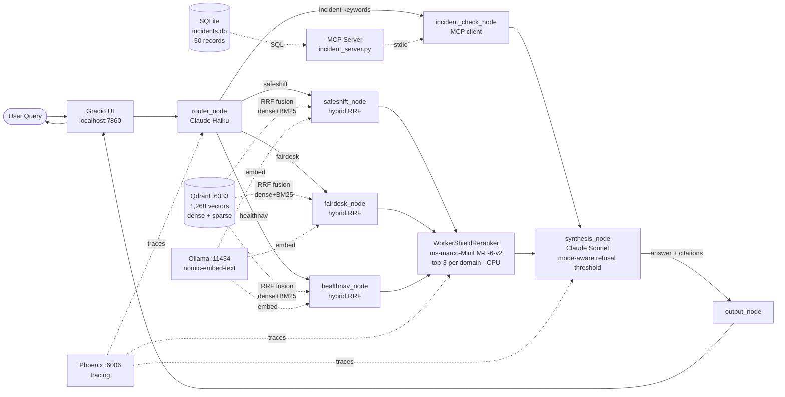

# WorkerShield v1

**Agentic RAG assistant for Australian workplace compliance — cited answers across WHS safety law, Fair Work entitlements, and occupational health.**


---

## Overview

WorkerShield is a production-grade agentic RAG platform that gives Australian employers and HR practitioners fast, cited answers to workplace compliance questions. It covers three domains — WHS safety law, Fair Work Act entitlements, and occupational health — within a single LangGraph agent graph that routes queries, retrieves relevant legislation and codes of practice, and synthesises a grounded answer with traceable citations.

The platform is designed for the compliance questions that arise in practice: FIFO fatigue risk, casual conversion rights, WorkCover claim obligations, flexible working requests for workers managing mental health conditions. Rather than returning a document list, WorkerShield returns a direct answer with the source, section, and domain clearly attributed.

WorkerShield v1 is a portfolio project demonstrating end-to-end agentic RAG architecture for a technical hiring audience evaluating production AI system design.

---

## Architecture



The graph implements a LangGraph `StateGraph` with a single typed state object (`WorkerShieldState`) flowing through: `router_node → domain retriever(s) + optional incident_check_node → WorkerShieldReranker → synthesis_node → output_node`. Retrieval is a three-pass pipeline: hybrid dense+BM25 RRF fusion via Qdrant, cross-encoder reranking to top-3 per domain, then Sonnet synthesis. A conditional edge after the router fans out to all three domain nodes when `cross_domain = True`. When the query mentions incident counts or trends, `incident_check_node` fires in parallel. See [`docs/ARCHITECTURE.md`](docs/ARCHITECTURE.md) for full design detail.

---

## Three Domains

| Domain | Coverage |
|---|---|
| **SafeShift** | WHS Act 2011 duties, QLD codes of practice, PPE, manual handling, fatigue risk, PCBU obligations |
| **FairDesk** | Fair Work Act, National Employment Standards, casual conversion, flexible working, termination notice |
| **HealthNav** | Occupational health, work-related mental health, workers compensation, WorkCover QLD obligations |

### Source Documents (10 doc_ids across 9 registered sources)

| Domain | Doc ID | Title |
|---|---|---|
| SafeShift | SS01 | Code of Practice — Managing the Work Environment |
| SafeShift | SS02 | Code of Practice — Hazardous Manual Tasks |
| SafeShift | SS03a | Queensland Work Health and Safety Act 2011 |
| SafeShift | SS03b | Guide to Model WHS Act — Key Duties |
| FairDesk | FD01 | National Employment Standards — Employee Guide |
| FairDesk | FD02 | Casual Employment — Employer Guide |
| FairDesk | FD03 | Flexible Working Arrangements — Guide |
| HealthNav | HN01 | Work-Related Mental Health — Employer Guide |
| HealthNav | HN02 | Fatigue Management in the Workplace |
| HealthNav | HN03 | Workers Compensation — Guide for Employers |

All sources are Australian open government publications (Safe Work Australia, Fair Work Ombudsman, WorkCover QLD). Chunking strategies per document: [`docs/CHUNKING_DECISIONS.md`](docs/CHUNKING_DECISIONS.md).

---

## Key Features

**Cross-domain agentic routing** — Claude Haiku classifies each query across all three domains with a JSON-structured prompt. When a query spans multiple regulatory frameworks, `cross_domain = True` fans out to all three Qdrant partitions simultaneously via LangGraph `Send` primitives.

**Three-pass retrieval pipeline** — Each domain retriever runs hybrid dense + BM25 sparse retrieval fused via Reciprocal Rank Fusion (RRF) in Qdrant, producing a wider candidate pool than dense-only search. A cross-encoder (`ms-marco-MiniLM-L-6-v2`, CPU inference) then re-scores every candidate pair against the query and keeps the top-3 per domain by logit score — eliminating noisy RRF candidates before synthesis.

**Citation-grounded synthesis** — Claude Sonnet synthesises answers exclusively from the reranked chunks. Every claim is annotated with a `[doc_id]` inline citation; the UI renders a structured sources table below the answer.

**Mode-aware refusal threshold** — Before calling the synthesis LLM, the system checks retrieval confidence using the right score scale for the active retrieval mode. When the cross-encoder reranker has run, the refusal decision uses cross-encoder logit scores (proceed if max logit > 0.0; refuse if < −1.0). In dense-only mode, the original cosine similarity thresholds apply (`avg < 0.65 AND max < 0.70`). The correct path is logged on every query. Out-of-scope queries return `confidence = "insufficient"` and direct the user to the relevant regulator.

**RAGAS-evaluated quality** — The system is evaluated against an 8-query golden dataset using the RAGAS framework with an OpenAI GPT-4o-mini judge (independent of the production stack). Retrieval progression across three configurations:

| Config | Faithfulness | Ctx Precision | Ctx Recall | Ans Relevancy |
|---|---|---|---|---|
| dense_only | 0.8938 | 0.7500 | 0.7500 | 0.6387 |
| hybrid RRF | 0.6878 | 0.7783 | 0.8750 | 0.5251 |
| **hybrid + reranker** (current) | **0.7331** | **0.7522** | **0.7500** | **0.5201** |

See [`tests/RAGAS_RESULTS.md`](tests/RAGAS_RESULTS.md) and [`tests/ragas_history/COMPARISON.md`](tests/ragas_history/COMPARISON.md) for full results.

**MCP incident database** — A FastMCP server (`mcp_server/incident_server.py`) exposes 50 synthetic incident records across all three domains as queryable tools (`query_incidents`, `get_incident_summary`, `get_incident_detail`). When the query mentions incident counts or trends, the `incident_check_node` calls the MCP server in parallel with domain retrieval; Sonnet weaves the statistics into the answer alongside document citations. The server is registered in Claude Code as `workershield-incidents`.

**Phoenix observability tracing** — Every query generates OpenTelemetry traces via Arize Phoenix, capturing router decisions, per-domain retrieval scores (including embedding time, sparse embed time, and RRF fusion indicator), cross-encoder rerank scores, and synthesis token usage. Traces are viewable at `http://localhost:6006`.

---

## Quick Start

**Prerequisites:** Python 3.11+, Docker (for Qdrant), Ollama with `nomic-embed-text` pulled, an Anthropic API key.

```bash
# 1. Clone
git clone https://github.com/rajesh5983/workershield-v1.git
cd workershield-v1

# 2. Install dependencies
pip install -r requirements.txt

# 3. Configure environment
cp .env.example .env
# Edit .env — set ANTHROPIC_API_KEY at minimum

# 4. Start Qdrant
docker run -p 6333:6333 qdrant/qdrant

# 5. Ingest corpus (run once)
python ingest/load_qdrant.py

# 6. Launch UI
bash launch.sh
# → http://localhost:7860
```

**Convenience alias:**
```bash
alias workershield='bash /path/to/workershield-v1/launch.sh'
workershield
```

---

## Example Queries

| Query | Domains | Cross-domain | Incident DB |
|---|---|---|---|
| "What are my obligations as a PCBU under the WHS Act?" | `[safeshift]` | No | No |
| "Is my casual employee entitled to conversion to permanent part-time?" | `[fairdesk]` | No | No |
| "What must I do when a worker lodges a WorkCover claim?" | `[healthnav]` | No | No |
| "What psychosocial hazards must I manage under WHS law?" | `[safeshift, healthnav]` | Yes | No |
| "My FIFO worker has a mental health condition and wants to reduce hours — what are my obligations?" | `[safeshift, fairdesk, healthnav]` | Yes | No |
| "How many fatigue-related incidents have we had this year, and what are our obligations to manage fatigue risk?" | `[safeshift, healthnav]` | Yes | **Yes** |

The fifth query is the primary cross-domain demo. The sixth demonstrates the MCP incident integration: `incident_check_node` fires alongside domain retrievers and Sonnet combines internal statistics with document obligations.

---

## Tech Stack

| Component | Technology | Purpose |
|---|---|---|
| Agent framework | LangGraph `StateGraph` | Directed graph with typed shared state and parallel fan-out |
| Router LLM | Claude Haiku (`claude-haiku-4-5-20251001`) | Lightweight domain classification, JSON output |
| Synthesis LLM | Claude Sonnet (`claude-sonnet-4-6`) | Multi-document cited answer generation |
| Vector store | Qdrant — Docker, `localhost:6333` | Domain-partitioned retrieval; `text-dense` + `text-sparse` named vectors |
| Dense embeddings | Ollama `nomic-embed-text` (768d) | Local query and ingest embeddings |
| Sparse embeddings | fastembed `Qdrant/bm25` | BM25 sparse vectors for hybrid retrieval |
| Retrieval mode | Hybrid RRF — dense + BM25 fused | Wider candidate pool; Qdrant REST query with `{"fusion": "rrf"}` |
| Reranker | `cross-encoder/ms-marco-MiniLM-L-6-v2` | Third-pass cross-encoder reranking; top-3 per domain; CPU inference |
| Incident database | SQLite `data/incidents.db` | 50 synthetic incident records across 3 domains |
| MCP server | FastMCP `mcp_server/incident_server.py` | Exposes incident DB as 3 tools over stdio transport |
| Chunk strategy | Sliding window — 400 tokens, 50 overlap | Applied per document; see CHUNKING_DECISIONS.md |
| Demo UI | Gradio `ui/app.py` | Browser query interface at `localhost:7860` |
| Evaluation | RAGAS + OpenAI GPT-4o-mini judge | Offline quality evaluation against 8-query golden dataset |
| Observability | Arize Phoenix + OTEL | Live LLM + reranker tracing at `localhost:6006` |

---

## Documentation

| Document | Contents |
|---|---|
| [`docs/ARCHITECTURE.md`](docs/ARCHITECTURE.md) | Full system design — Mermaid diagrams, node responsibilities, state machine, ingest pipeline, observability stack |
| [`docs/CHUNKING_DECISIONS.md`](docs/CHUNKING_DECISIONS.md) | Per-document chunking strategy rationale |
| [`data/incidents_schema.md`](data/incidents_schema.md) | Incident database schema — fields, categories, supported query patterns |
| [`mcp_server/README.md`](mcp_server/README.md) | MCP server registration and usage guide |
| [`tests/RAGAS_RESULTS.md`](tests/RAGAS_RESULTS.md) | RAGAS evaluation results — scores, methodology, per-query breakdown |

---

## Known Limitations

- **Corpus coverage.** v1 covers 10 doc_ids across 3 domains, with QLD-centric WHS sources. Modern award specifics, state-based WHS regulations outside QLD, and workers compensation schemes outside Queensland are not covered.
- **No conversation memory.** Each query is processed independently; follow-up questions cannot reference prior answers. Stateless by design for compliance audit trail clarity.
- **Single-pass retrieval.** No ReAct reflection loop — retrieval and synthesis happen once per query. Ambiguous queries cannot trigger follow-up retrievals.
- **Answer Relevancy gap.** RAGAS Answer Relevancy sits at 0.52 against a 0.80 target in the current hybrid+reranker configuration, driven primarily by Q2 (casual overtime on public holidays — a corpus coverage gap) and Q1/Q5 scoring variance from the GPT-4o-mini judge. These are corpus coverage and evaluation noise issues, not synthesis failures.

---

## Roadmap

| Version | Planned |
|---|---|
| **v2 corpus** | Expand to 20+ documents per domain; modern awards, state-based safety regulations (NSW, VIC), Fair Work Commission decisions |
| **HealthNav expansion** | Add WorkSafe VIC and SafeWork NSW; return-to-work coordinator obligations |
| **Microsoft Fabric integration** | Move vector index and run logs to Fabric OneLake; Fabric Eventhouse for real-time query telemetry |
| **ReAct reflection loop** | Post-retrieval confidence check with targeted follow-up retrieval before synthesis |

---

## Author

Built by **Raj Prasannakumar** — BrickByData / ModernAnalyticsLab

- LinkedIn: [linkedin.com/in/rajprasannakumar](https://linkedin.com/in/rajprasannakumar)
- GitHub: [github.com/rajesh5983](https://github.com/rajesh5983)

WorkerShield v1 is a portfolio project demonstrating production-grade agentic RAG architecture. It is not legal advice.
