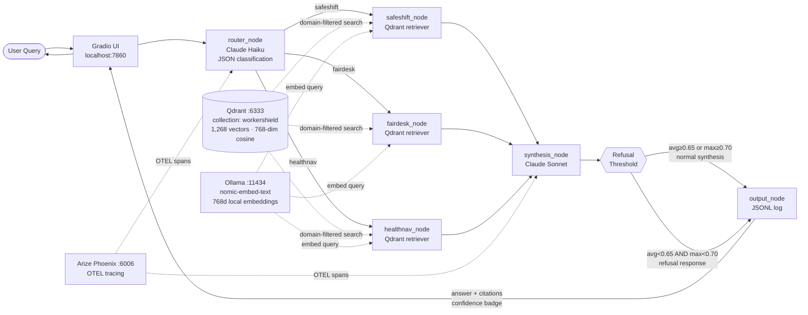
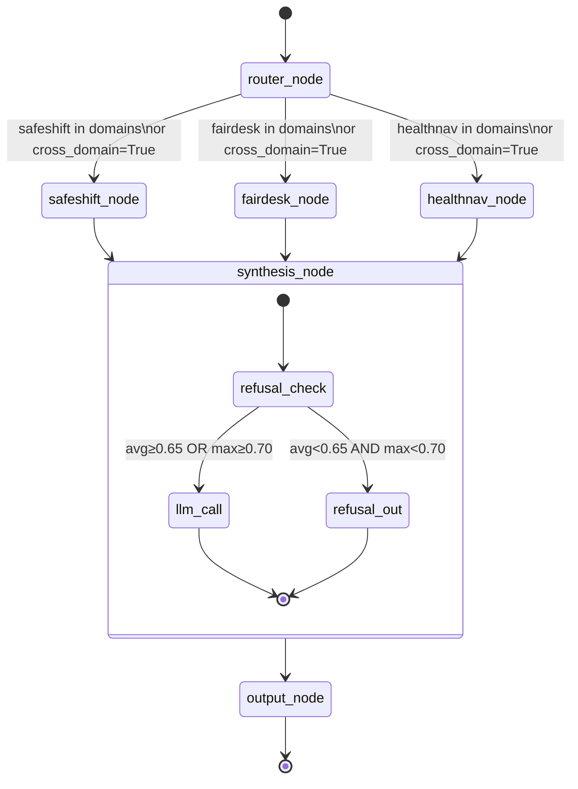
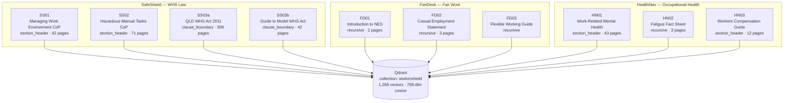
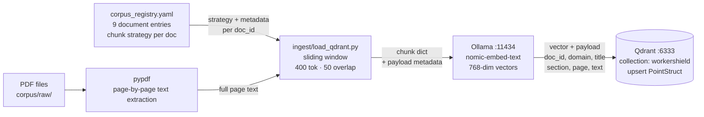
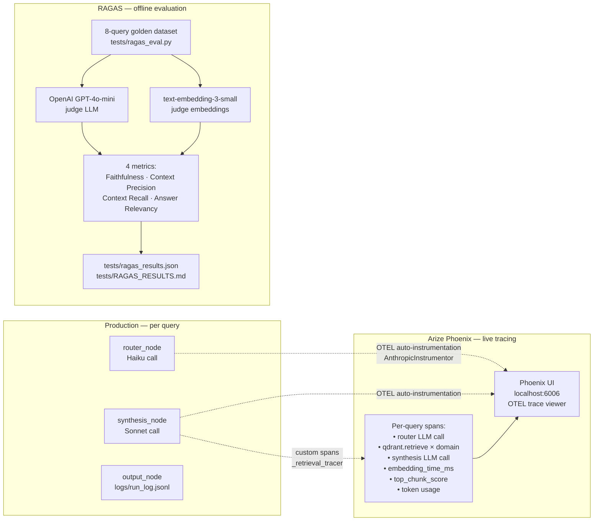

# WorkerShield v1 — System Architecture

---

## 1. System Overview

WorkerShield is a three-domain agentic RAG platform for Australian workplace compliance. A LangGraph `StateGraph` orchestrates four nodes — router, domain retrievers, synthesis, output — connected by a conditional fan-out edge that activates one, two, or all three Qdrant partitions depending on query scope. The synthesis node runs a pre-LLM refusal threshold check; queries whose retrieved chunks fall below calibrated confidence thresholds are declined gracefully rather than synthesised from weak evidence. Every query is traced end-to-end via Arize Phoenix.

---

## 2. System Architecture



---

## 3. LangGraph State Machine

All inter-node data flows through a single `WorkerShieldState` TypedDict. No direct node-to-node coupling exists outside this object. The `safeshift_chunks`, `fairdesk_chunks`, and `healthnav_chunks` fields are annotated with `operator.add` so parallel retrieval nodes can append without overwriting each other.

### State fields

| Field | Type | Set by | Purpose |
|---|---|---|---|
| `query` | `str` | caller | Raw user input, unmodified |
| `detected_domains` | `list[str]` | `router_node` | Domains identified: `safeshift`, `fairdesk`, `healthnav` |
| `cross_domain` | `bool` | `router_node` | `True` → fan out to all three domain nodes |
| `safeshift_chunks` | `list[dict]` | `safeshift_node` | Top-K chunks from SafeShift partition (score, text, metadata) |
| `fairdesk_chunks` | `list[dict]` | `fairdesk_node` | Top-K chunks from FairDesk partition |
| `healthnav_chunks` | `list[dict]` | `healthnav_node` | Top-K chunks from HealthNav partition |
| `synthesis_input` | `str` | `synthesis_node` | Assembled context string passed to Sonnet |
| `final_answer` | `str` | `synthesis_node` | JSON-serialised answer object (answer, citations, confidence) |
| `citations` | `list[dict]` | `synthesis_node` | Structured citation list for UI rendering |
| `confidence` | `str` | `synthesis_node` | `"high"` / `"medium"` / `"low"` / `"insufficient"` |

### State machine graph



### Conditional routing

After `router_node`, LangGraph's `Send` primitive fans out to domain nodes:

- **`cross_domain = True`** → all three domain nodes run (in parallel), regardless of which domains the router detected. This ensures multi-domain queries never silently drop context.
- **`cross_domain = False`** → only the node(s) in `detected_domains` run.

The router sets `cross_domain = True` conservatively — preferring over-retrieval to missed context.

---

## 4. Node Responsibilities

| Node | LLM / Tool | Key Logic |
|---|---|---|
| `router_node` | Claude Haiku | Sends the query with a JSON classification prompt; expects `{domains: [...], cross_domain: bool, reasoning: str}`. Falls back to keyword matching (`"WHS"` → `safeshift`, `"casual"` → `fairdesk`, etc.) when the model returns malformed output. |
| `safeshift_node` | Qdrant + Ollama | Embeds the query via `nomic-embed-text` (768d). Queries Qdrant filtered by `domain=safeshift`. Returns top-K chunk dicts with score, text, doc_id, title, section. Wrapped in a custom OTEL span recording embed time and top-chunk score. |
| `fairdesk_node` | Qdrant + Ollama | Same as above, filtered by `domain=fairdesk`. |
| `healthnav_node` | Qdrant + Ollama | Same as above, filtered by `domain=healthnav`. |
| `synthesis_node` | Claude Sonnet | (1) Checks refusal threshold across all chunks. (2) If proceeding, assembles domain-labelled context and calls Sonnet with a strict JSON-output system prompt. (3) Post-processes: unwraps double-encoded responses, heals unescaped inner quotes via a character-level JSON parser, derives citations, computes confidence. |
| `output_node` | None | Logs the run to `logs/run_log.jsonl`. No state mutation. |

### Refusal threshold

Before the synthesis LLM call, `synthesis_node` checks:

```
avg_score = mean([chunk["score"] for chunk in all_chunks])
max_score = max([chunk["score"] for chunk in all_chunks])

if avg_score < 0.65 AND max_score < 0.70:
    → skip LLM, return structured refusal with confidence="insufficient"
```

Thresholds calibrated from observed score distributions:

| Query type | avg_score | max_score |
|---|---|---|
| Out-of-scope (e.g. "capital of France") | ~0.58 | ~0.62 |
| In-scope (e.g. "psychosocial hazards under WHS") | ~0.74 | ~0.77 |

The gap between 0.62 and 0.74 gives clean separation with the chosen thresholds.

---

## 5. Corpus and Chunking

10 logical doc_ids across 9 registered source documents. SS03 is split at ingestion into two doc_ids (legislative clauses vs. duties guide) to enable per-section retrieval precision.



**Chunking parameters (uniform):** 400-token window, 50-token overlap, sliding stride.

**Strategy selection per document:**

| Strategy | When used | Documents |
|---|---|---|
| `section_header` | Long documents with clear numbered sections | SS01, SS02, HN01, HN03 |
| `clause_boundary` | Legislation with strict numbered clause hierarchy | SS03a, SS03b |
| `recursive` | Short fact sheets and prose-heavy guides | FD01, FD02, FD03, HN02 |

See [`docs/CHUNKING_DECISIONS.md`](CHUNKING_DECISIONS.md) for full per-document rationale.

---

## 6. Ingest Pipeline

Runs once to populate Qdrant. Driven entirely by `corpus/corpus_registry.yaml` — adding a new document requires only a registry entry and the PDF.



**Payload fields stored per vector:** `doc_id`, `domain`, `title`, `source` (URL), `section`, `page_estimate`, `text`.

---

## 7. Observability Stack



**RAGAS results summary (run date: 2026-06-12):**

| Metric | Score | Target | Status |
|---|---|---|---|
| Faithfulness | 0.894 | ≥ 0.85 | ✅ |
| Context Precision | 0.750 | ≥ 0.70 | ✅ |
| Context Recall | 0.750 | ≥ 0.70 | ✅ |
| Answer Relevancy | 0.639 | ≥ 0.80 | ⚠️ |

Answer Relevancy misses target primarily on Q2 (casual overtime on public holidays — corpus coverage gap) and Q5 (Code of Practice definition — definitional chunks not surfacing). Both are retrieval corpus issues, not synthesis failures. See [`tests/RAGAS_RESULTS.md`](../tests/RAGAS_RESULTS.md) for the full per-query breakdown.

---

## 8. The Killer Demo Query

**Query:** *"My FIFO worker has a mental health condition and wants to reduce hours — what are my obligations?"*

**Expected behaviour:** `cross_domain = True`, all three retrievers fire, citations drawn from SafeShift (WHS duty of care), FairDesk (NES flexible working entitlements), and HealthNav (mental health employer obligations) in a single synthesised answer.

**Step-by-step:**

1. **Router (Haiku):** Detects `["healthnav", "fairdesk"]` from explicit signals ("mental health condition" → HealthNav, "reduce hours" → FairDesk). FIFO + mental health + safety duties triggers `cross_domain = True`, pulling SafeShift regardless.
2. **Conditional edge:** `Send` fans out to all three domain nodes in parallel.
3. **Retrievers:** Three Qdrant queries execute — each returns top-K chunks filtered by domain. SafeShift returns PCBU psychosocial hazard duties; FairDesk returns NES flexible working entitlements; HealthNav returns mental health reasonable adjustment obligations.
4. **Refusal check:** Scores are well above threshold — synthesis proceeds normally.
5. **Synthesis (Sonnet):** Receives all chunks as a domain-labelled context block. Returns a JSON answer with inline `[doc_id]` citations and an explicit `cross_domain_connection` paragraph.
6. **Output:** Domain badges for all three light up; confidence badge shows `HIGH` or `MEDIUM`; citations table lists sources by domain.

---

## 9. File Structure

```
workershield-v1/
├── agents/
│   ├── graph.py            # LangGraph StateGraph — WorkerShieldState, nodes, edges
│   ├── router.py           # Domain classifier — Haiku + keyword fallback
│   ├── retrieval.py        # Domain retriever helpers
│   └── synthesis.py        # Synthesis node — refusal threshold, Sonnet call, JSON healing
├── corpus/
│   ├── corpus_registry.yaml    # Master registry — 9 documents, metadata, chunk config
│   └── raw/                    # Source PDFs (gitignored)
├── docs/
│   ├── ARCHITECTURE.md         # This document
│   └── CHUNKING_DECISIONS.md   # Per-document strategy rationale
├── ingest/
│   └── load_qdrant.py          # PDF → chunk → embed → Qdrant upsert
├── logs/
│   └── run_log.jsonl           # Per-query JSONL observability log
├── observability/
│   └── phoenix_setup.py        # Arize Phoenix OTEL setup
├── prompts/
│   └── PROMPTS.md              # Router and synthesis prompt reference
├── tests/
│   ├── ragas_eval.py           # RAGAS evaluation runner
│   ├── ragas_results.json      # Raw scores (machine-readable)
│   └── RAGAS_RESULTS.md        # Human-readable evaluation results
├── ui/
│   └── app.py                  # Gradio demo interface
└── utils/
    ├── model_factory.py        # LLMClient + parse_llm_json (JSON healing)
    ├── logger.py               # JSONL run logger
    └── log_reader.py           # Log summary viewer
```

---

## 10. What Is Deliberately Out of Scope for v1

**No ReAct reflection loop.** Retrieval and synthesis are single-pass. After retrieval, the system cannot decide "these chunks aren't good enough — I need to reformulate the query and try again." The refusal threshold is the only post-retrieval escape valve.

**No conversation memory.** Each query is fully stateless. Follow-up questions cannot reference prior answers. This is intentional — in compliance contexts, each answer should be independently reproducible and auditable without relying on session context.

**No input-side guardrails.** Beyond the retrieval confidence threshold, there is no input classification to detect off-topic or harmful queries before retrieval runs. The refusal is a post-retrieval signal, not a pre-retrieval gate.

**Local model stack not exposed in v1 UI.** The codebase supports `model_provider: local` (Ollama Mistral) in `config/model_config.yaml`, and the `ModelFactory` respects this. The v1 Gradio UI runs the Anthropic stack only — the provider switcher was removed to keep the demo focused.

**Single collection, domain partitioning via metadata.** Qdrant stores all documents in one collection (`workershield`) with domain filtered at query time via payload conditions. Per-domain collections would give cleaner separation but add ingest complexity for a 10-document corpus.
