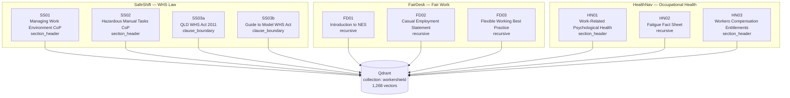

# WorkerShield Chunking Decisions

Strategies assigned per document after validation against actual PDF content
(first 3 pages sampled per document, June 2026).

| doc_id | title | strategy | rationale |
|--------|-------|----------|-----------|
| FD01 | Introduction to NES | recursive | Short 2-page fact sheet, flowing prose with bullet points — no clause hierarchy |
| FD02 | Casual Employment Statement | recursive | Short 3-page fact sheet, flowing prose |
| FD03 | Flexible Working Best Practice Guide | recursive | Primarily prose narrative — no pipe/tab tables detected in PDF extraction |
| HN01 | Work-Related Psychological Health | section_header | 43-page guide with clear section structure beyond TOC |
| HN02 | Fatigue Fact Sheet | recursive | Short 3-page fact sheet, flowing prose |
| HN03 | Workers Compensation Entitlements | section_header | 12-page structured guide with headed sections |
| SS01 | Managing Work Environment CoP | section_header | 42-page Code of Practice with numbered section headings |
| SS02 | Hazardous Manual Tasks CoP | section_header | 71-page Code of Practice with numbered section headings |
| SS03a | Queensland WHS Act 2011 | clause_boundary | 308-page legislation with strict numbered clause hierarchy |
| SS03b | Guide to Model WHS Act | clause_boundary | 42-page duties guide structured around legislative clauses |

---

## Corpus Map

